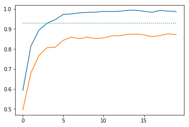

# Traffic Sign Recognition

---

**Build a Traffic Sign Recognition Project**

Project steps:
* Load the data set
* Explore, summarize and visualize the data set
* Design, train and test a model architecture
* Use the model to make predictions on new images
* Analyze the softmax probabilities of the new images

---

### Data Set Summary & Exploration

#### Dataset Summary

- Number of training examples = 34799
- Number of testing examples = 12630
- Number of validation examples = 4410
- Image data shape = (32, 32, 3)
- Number of classes = 43

#### Exploratory Visualization

Distribution of Training Examples

### Design and Test a Model Architecture

#### Preprocessing

- Normalize image data: All image pixel data is zero-center in the range -0.5 and 0.5 to facilitate the convergence speed of the gradient-descent algorithm.
- Shuffle training dataset: To avoid start training the network with of highly correlated samples.

No data augmentation was needed to achieve the required accuracy on the validation set.

#### Model Architecture

The final model consisted of the following layers:

| Layer         		|     Description	        					|
|:---------------------:|:---------------------------------------------:|
| Input         		| 32x32x3 RGB image   							|
| Convolution 5x5     	| 1x1 stride, valid padding, outputs 28x28x6 	|
| Relu					|												|
| Max pooling	      	| 2x2 stride, valid padding, outputs 14x14x6  	|
| Convolution 5x5	    | 1x1 stride, valid padding, outputs 10x10x16	|
| Relu					|												|
| Max pooling	      	| 2x2 stride, valid padding, outputs 5x5x16  	|
| Fully connected		| Outputs 120        							|
| Relu  				| Dropout 0.5        							|
| Fully connected   	| Outputs 84									|
| Relu                  | Dropout 0.5									|
| Fully connected		| Outputs n_classes		    	         		|
| Softmax               | 												|

#### Model Training

- Learning rate: 0.001
- Epochs: 20
- Bach size: 256
- Dropout: 0.5

#### Solution Approach

The final model results were:
* training set accuracy of 0.988
* validation set accuracy of 0.952
* test set accuracy of 0.929

##### First Iteration
LeNet architecture based on the previous lab. It's a well know and simple architecture for image classification.

The network was trained for 20 epochs with the following results:

* training set accuracy > 0.99
* validation set accuracy < 0.90

These results show that the model is **Overfitting**, it basically "memorized" the training data

- Reduce model complexity
- Increase the training data
- Regularization:
  - Dropout
  - l2 regularization
  - Early stoping

##### Second Iteration
A Dropout of 50% was added between the fully connected layers to avoid overfitting.

The network was trained for 20 epochs with the following results:

* training set accuracy of 0.988
* validation set accuracy of 0.952

Result: **Validation accuracy > 0.93**

Test accuracy: 0.929

### Test a Model on New Images

#### Acquiring New Images

German traffic signs on the web:

   
 
 

Most of these images appears to be enhanced photographs, with good illumination and well focused, in contrast with the images from the dataset. This differences may affect the prediction results.

#### Performance on New Images

Results of the prediction:

| Image			        |     Prediction	        					|
|:---------------------:|:---------------------------------------------:|
| Priority road      		| Priority road  									|
| Stop     			| Stop 										|
| No vehicles					| No vehicles											|
| No entry	      		| Stop					 				|
| General caution		| General caution      							|
| Speed limit (60km/h)		| Speed limit (60km/h)      							|
| End of all speed and passing limits		| End of all speed and passing limits     							|
| No passing		| No entry      							|

The accuracy of 75% on the new images differs from the 93% on the test set thus it seems the model is overfitting on the images from the web

#### Model Certainty - Softmax Probabilities

